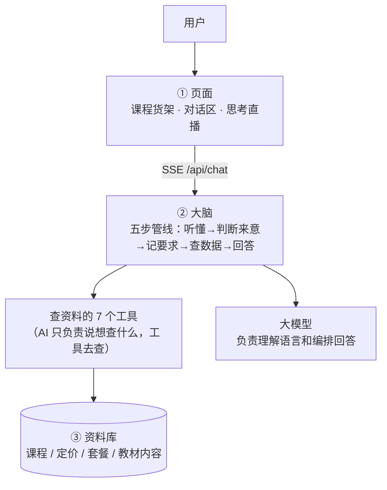
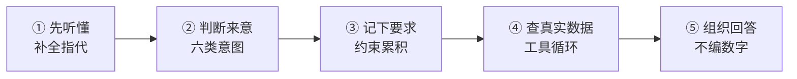
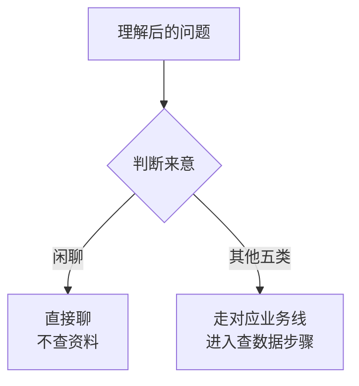

# 多轮智能问答 Demo（课程学习系统）

> 版本：v1.0（2026-08-02）
>
> 一句话：这是一个「课程售课咨询 AI 助手」的演示项目——用户像聊天一样咨询课程，AI 像资深课程顾问一样一步步问清楚需求，再给出精准推荐，并且把每一步"思考过程"都实时展示在页面上。
>
> 配套文档：[方案设计](方案设计_多轮智能问答课程推荐系统.md)（为什么这么做） · [验收文档](验收文档_多轮智能问答Demo.md)（怎么逐项验收） · [调研报告](调研报告_多轮智能问答开源项目.md)（行业调研）

---

## 一、这是什么产品（业务视角）

### 1.1 解决什么问题

一个在线课程平台（卖英语课），有 10 门课、5 种买法（单买 / 套餐 / 包月 / 包年）。用户来咨询时最常问的三类问题：

- **我该买哪门课？**（零基础、初中生、只有 30 天……每个人情况不同）
- **多少钱？哪个买法划算？**
- **这门课到底教什么？**

传统做法靠客服人工回答；这个产品让 **AI 当客服**：多轮聊天，越聊越懂用户，最后给出推荐并直接生成订单。

### 1.2 核心价值：多轮提问如何提高答案准确性

- 不在一开始就"猜"所有可能性，而是**每轮把用户的新要求累积起来**（水平、时间、预算……）
- 候选课程**随要求逐轮收窄**：10 门 → 5 门 → 2 门 → 精准推荐
- 用户每轮说"再考虑一下预算/时间"，推荐结果都会跟着变，越聊越准

### 1.3 能做什么 / 边界是什么

| 能做什么 | 边界（不能做什么） |
|---|---|
| 根据情况推荐课程，并解释为什么推这几门 | 只懂"英语课程"，问围棋/数学会如实说"暂未开设" |
| 报价格、对比套餐哪个更划算（金额来自资料库） | 库里没有的信息（如退费政策）会明说"暂无"，绝不编造 |
| 讲课程教材里具体教什么知识点 | 订单是演示用的，不会真的扣款 |
| 检查"XX 天内能不能学完"，不够时给替代方案 | — |
| 生成演示订单号 | — |

### 1.4 页面长什么样

- **左边**：课程货架（10 门课卡片，可点选或拖拽进对话）
- **中间**：多轮对话区（像微信聊天）
- **右边**：AI 思考过程直播（它正在调什么工具、查到什么，边跑边播）

---

## 二、整体结构：三个部分

| 部分 | 通俗理解 | 技术实现 |
|---|---|---|
| ① 页面 | 用户看到的界面（货架 + 聊天 + 思考直播） | 前端：React + Ant Design X |
| ② 大脑 | 听懂人话、决定怎么办、组织回答 | 后端：Spring Boot + Spring AI + DeepSeek 大模型 |
| ③ 资料库 | 存课程/价格/套餐/教材内容的"档案柜" | SQLite 本地数据库 + 向量索引 |



> 大白话：用户跟"大脑"聊天 → 大脑需要真实数据时，指挥"工具"去"资料库"查 → 查到后组织成回答 → 边做边把过程直播给用户看。

---

## 三、AI 是怎么一步一步回答的（核心流程）

用户每说一句话，系统都会完整走一遍以下 5 步：

| 步骤 | 大白话 | 技术名 |
|---|---|---|
| ① 先听懂 | 把"那大概多少钱？"这类指代不明的说法，结合历史对话补全成完整意思 | 查询改写 |
| ② 判断来意 | 判断用户是来要推荐、问价格、问内容、问套餐、问规划、还是闲聊 | 意图分类 |
| ③ 记下要求 | 把新要求（如"零基础""一个月内"）记进需求画像，越攒越多 | 状态更新 |
| ④ 查真实数据 | 按需求画像去资料库查符合条件的真实数据 | 工具循环 |
| ⑤ 组织回答 | 基于查到的真实数据组织回答，不编数字 | 生成回答 |



### 3.1 先听懂（查询改写）

- 场景：用户前面聊了"雅思基础班"，接着问"**那它**多少钱？"
- 做法：把历史对话和当前问题一起交给大模型，补全成"**雅思基础班**多少钱？"
- 目的：让后面的步骤不依赖上下文也能理解

### 3.2 判断来意（意图分类）

把问题归为六类之一，决定走哪条业务线：

| 意图 | 用户大概在问什么 | 走什么流程 |
|---|---|---|
| 课程推荐 | 我该学什么课 | 推荐链 |
| 价格咨询 | 多少钱 / 贵不贵 | 价格链 |
| 内容咨询 | 课里教什么 | 内容链 |
| 套餐咨询 | 买套餐划算吗 | 套餐链 |
| 学习规划 | 时间够不够 / 怎么安排 | 规划链 |
| 闲聊 | 你好、谢谢 | 不查资料，直接聊 |



### 3.3 记下要求（约束累积）

- 场景：第 1 轮"我想学英语" → 记下 {科目:英语}；第 2 轮"我基础差" → 追加 {水平:零基础}；第 4 轮"一个月内学完" → 再追加 {时间:≤30天}
- 做法：每轮从用户话里抽取"约束"，合并进需求画像，存入资料库
- 效果：**约束越多 → 查出来的候选越少 → 推荐越准**

### 3.4 查真实数据（工具循环）

AI 自己不会直接查数据库，而是用 7 个"工具"：

| 工具 | 大白话 | 查什么 |
|---|---|---|
| search_courses 课程检索 | 按条件筛课程 | 课程表（10 门课） |
| query_price 价格查询 | 报单买价格 | 定价表 |
| match_package 套餐匹配 | 算套餐 vs 单买哪个省 | 套餐表 |
| search_content 内容检索 | 查教材里具体讲什么 | 教材章节/段落 |
| check_duration 时长检查 | 检查时间够不够，不够给替代 | 课程表 + 对比逻辑 |
| finalize_recommend 收口推荐 | 综合所有要求出最终方案 | 需求画像 + 课程表 |
| create_order 下单 | 生成演示订单号 | 订单（内存） |

> 关键设计：AI 只负责"说想查什么"（输出结构化参数），真正的查询由**人工预写的查询模板**执行——AI 不直接碰数据库，既安全又防编造。

### 3.5 组织回答（生成回答）

回答里的价格、时长、套餐全部来自工具返回的真实数据；**宁可说"没有"，也不编一个数**。

---

## 四、两个真实例子（完整走一遍）

> 以下两个例子是验收时真实跑过的流程，数据和页面一致。

### 例子 1：从零开始的多轮课程咨询（核心场景）

一位零基础用户想学英语，和 AI 聊了 6 轮：

**第 1 轮**

- 用户说：`我想学英语，有什么课？`
- 系统怎么理解：来意=课程推荐；记下要求 {科目:英语}
- 查了什么：课程检索 → 课程表全部课程
- 查到什么：10 门课（自然拼读、小学英语基础、新概念……）
- 回答：按年级分组列出课程，并追问"您目前英语水平如何？"

**第 2 轮**

- 用户说：`我基础比较差，想从零开始`
- 系统怎么理解：来意仍是课程推荐；**追加要求 {水平:零基础}**
- 查了什么：课程检索 → 课程表，过滤"适合零基础"的课
- 查到什么：候选从 10 门**收窄到入门课**（自然拼读 30 天 / 小学英语基础 60 天 / 雅思基础班 45 天等）
- 为什么走这个分支：用户给了新约束"零基础"，所以只推荐入门级课程
- 回答：列出入门课，追问"您想多长时间内学完？"

**第 3 轮**

- 用户说：`那大概要多少钱？`
- 系统怎么理解：**先改写**——"那"指上一轮推荐的入门课，补全为"这些入门课程价格是多少？"；来意=价格咨询
- 查了什么：价格查询 → 定价表
- 查到什么：各门课单价（自然拼读 ¥999 / 小学英语基础 ¥1999 / 雅思基础班 ¥1999……）
- 为什么走这个分支：这句话不带新约束、且明显在问钱，所以直接查价格
- 回答：直接报出价格清单（**没有**反问"你想学什么"——证明改写生效）

**第 4 轮**

- 用户说：`我想一个月内能学完的`
- 系统怎么理解：来意=课程推荐；**追加要求 {时间:≤30 天}**
- 查了什么：时长检查 → 课程表，筛"时长≤30 天"
- 查到什么：自然拼读（30 天）、口语情景对话（30 天）、雅思速成班（28 天）
- 回答：推荐这三门，并提示"还有套餐可选，可能更划算"

**第 5 轮**

- 用户说：`有套餐更划算吗？`
- 系统怎么理解：来意=套餐咨询
- 查了什么：套餐匹配 → 套餐表，并计算"单买累加 vs 套餐价"
- 查到什么：例如雅思全科套餐 ¥3499（含雅思基础+速成+口语+模考），单买三门课合计 ¥5897，**省 ¥2398**
- 回答：套餐对比 + 省多少钱的结论

**第 6 轮**

- 用户说：`就推荐雅思的那个吧`
- 系统怎么理解：来意=收口；"雅思的那个"改写为具体套餐
- 查了什么：收口推荐（综合 6 轮画像评分）+ 下单
- 查到什么：最终方案（课程+价格+时长）→ 生成订单号 CO-20260802-001
- 回答：推荐方案卡片 + 订单号 + "请在 15 分钟内完成支付"

> 这条例子完整展示了价值闭环：**约束逐轮累积 → 候选从 10 门收到 3 门 → 报真实价格 → 算套餐省钱 → 下单**。

### 例子 2：约束冲突时的兜底（不硬推）

**第 1 轮**

- 用户说：`我只有 20 天，想学完雅思基础班`
- 系统怎么理解：来意=学习规划；记下要求 {目标课程:雅思基础班, 时间:≤20 天}
- 查了什么：时长检查 → 课程表，查"雅思基础班"时长
- 查到什么：雅思基础班需 **45 天** > 用户只有 20 天 → **无直接命中（冲突）**
- 为什么走这个分支：约束与课程时长矛盾，触发"冲突兜底"逻辑
- 回答：**如实说明**"雅思基础班需 45 天，20 天内无法完成"，再给替代方案"雅思速成班 28 天 ¥2599，更接近您的时间要求"——不硬推、不编造

> 这条例子体现业务上最重要的可信度：**AI 不会为了成交撒谎，冲突时如实说明并给替代**。

---

## 五、技术构成（技术同事看，业务可跳过）

| 环节 | 技术 | 它是干嘛的 |
|---|---|---|
| 后端框架 | Java 17 + Spring Boot 3.5.3 | 服务的"大脑"，处理请求、编排流程 |
| AI 框架 | Spring AI 1.1.6 | 统一对接大模型的 Java 框架 |
| 生成模型 | DeepSeek-V4-Flash | 负责理解语言、写回答（在线 API） |
| 向量模型 | SiliconFlow BAAI/bge-m3（免费） | 把教材段落转成"可相似度检索"的向量 |
| 向量索引 | SimpleVectorStore（内存） | 内容检索：问"阅读课讲什么"能命中相关段落 |
| 关系库 | SQLite（backend/data/course.db） | 课程/定价/套餐/会话画像的档案柜 |
| 前端 | React 18 + Vite 5 + Ant Design X 1.6.1 | 页面三栏布局 + SSE 流式接收思考直播 |
| 端口 | 后端 8081 / 前端 5173 | — |

## 六、资料库里有什么数据

| 表 | 通俗理解 | 数据量 |
|---|---|---|
| subject | 科目 | 1 个（英语） |
| course | 课程清单（名称/教材/年级/课内课外/时长/简介） | 10 门 |
| chapter / unit / paragraph | 教材目录：章节→单元→知识点段落 | 18 段 |
| pricing | 定价（单买/套餐/包月/包年） | 10 条单买 |
| package / package_course | 套餐 + 套餐里包含哪些课 | 5 个套餐 |
| session_state | 每个会话的需求画像和历史记录 | 运行时生成 |

## 七、怎么跑起来

### 前置要求

- JDK 17+（后端）
- Node.js 18+（前端）
- 两个 API Key：DeepSeek（对话）、SiliconFlow（向量，bge-m3 免费）

### 启动

```bash
cp .env.example .env   # 填入 Key
./start.sh             # 一键启动（后端 8081 + 前端 5173）
./start.sh stop        # 停止
```

浏览器打开 **http://localhost:5173**，验收步骤对照 `验收文档_多轮智能问答Demo.md`。

## 八、项目文件结构

```
agent_demo/
├── start.sh                  # 一键启动/停止
├── .env                      # API Key 配置（勿提交）
├── docker-compose.yml        # 可选容器化方式（默认不用）
├── README.md
├── 方案设计_多轮智能问答课程推荐系统.md
├── 验收文档_多轮智能问答Demo.md
├── 调研报告_多轮智能问答开源项目.md
├── backend/
│   ├── pom.xml
│   ├── data/course.db        # SQLite（运行时生成）
│   └── src/main/java/com/demo/courserag/
│       ├── controller/ChatController.java      # /api/chat(SSE) /api/courses /api/packages
│       ├── service/AgentService.java           # 五步管线 + 工具循环
│       ├── service/ToolExecutor.java           # 7 工具
│       ├── service/RetrievalService.java       # 向量检索 + 关键词兜底
│       ├── service/EmbeddingIndexer.java       # 启动时向量化教材段落
│       ├── service/DatabaseInitializer.java    # 建表 + 种子数据
│       ├── repository/CourseRepository.java    # 业务查询
│       ├── repository/SessionRepository.java   # 会话画像/历史
│       ├── config/VectorStoreConfig.java
│       └── model/
└── frontend/
    ├── package.json
    ├── vite.config.js        # 5173 → 代理 /api → 8081
    └── src/App.jsx           # 三栏布局 + SSE 解析
```

## 九、后续可改进

| 项 | 现状 | 改进方向 |
|---|---|---|
| 向量库 | 内存版 | 数据量大时换 ChromaDB/Milvus |
| 流式输出 | 整段推送 | 改成逐字流式 |
| 长期记忆 | 会话内记忆 | 跨会话记住老客户偏好 |
| 评估 | 人工验收 | 自动化指标（命中率等） |
| 订单 | 演示订单号 | 接真实支付 |
| 安全 | 无鉴权 | 生产需加用户体系与限流 |

## 十、许可证

本项目为学习演示项目，未指定开源许可证（All Rights Reserved），代码仅供学习参考，请勿用于生产环境。
