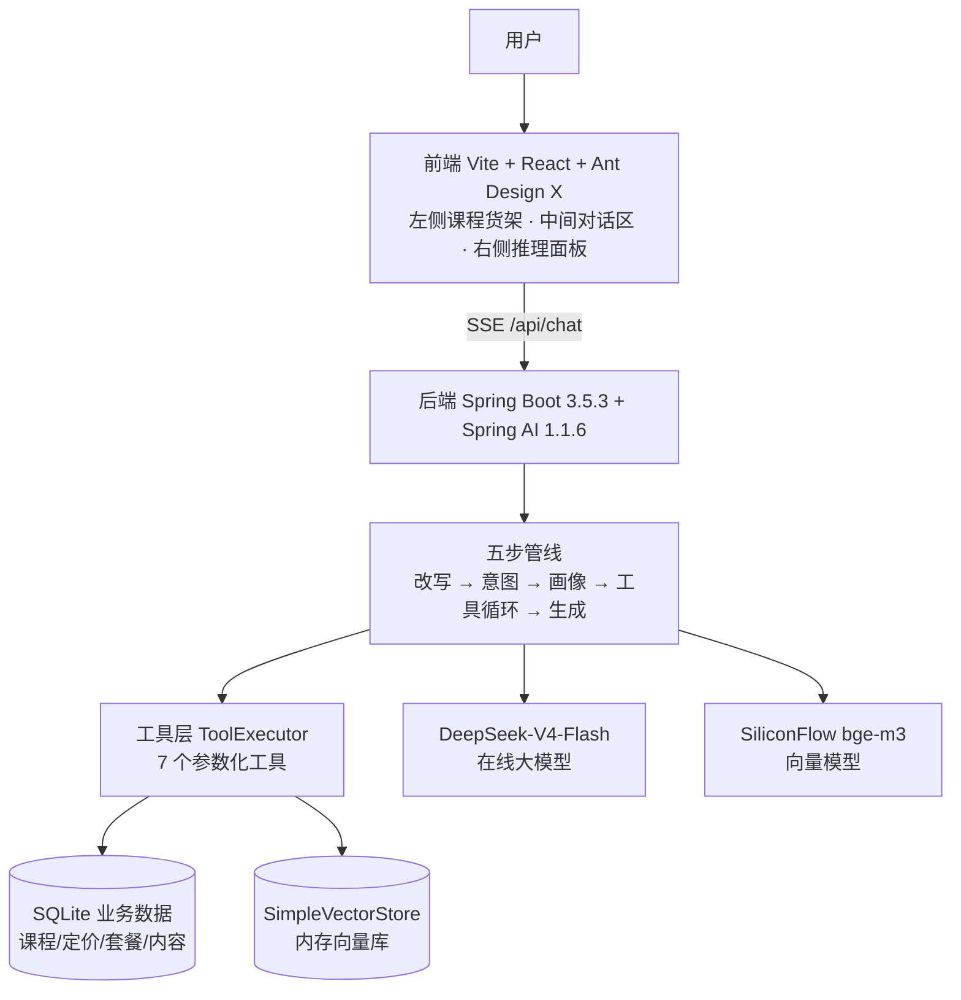
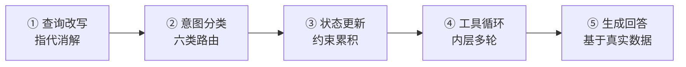
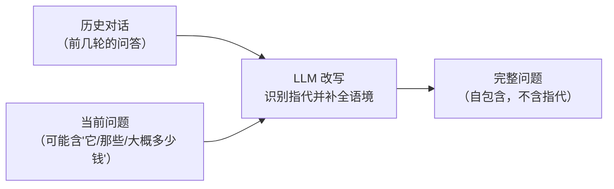
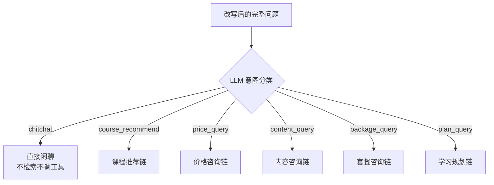
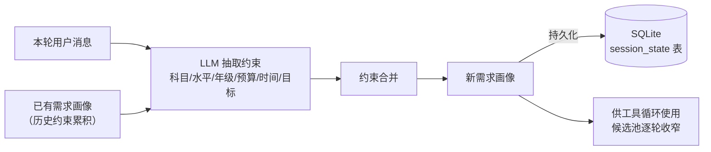
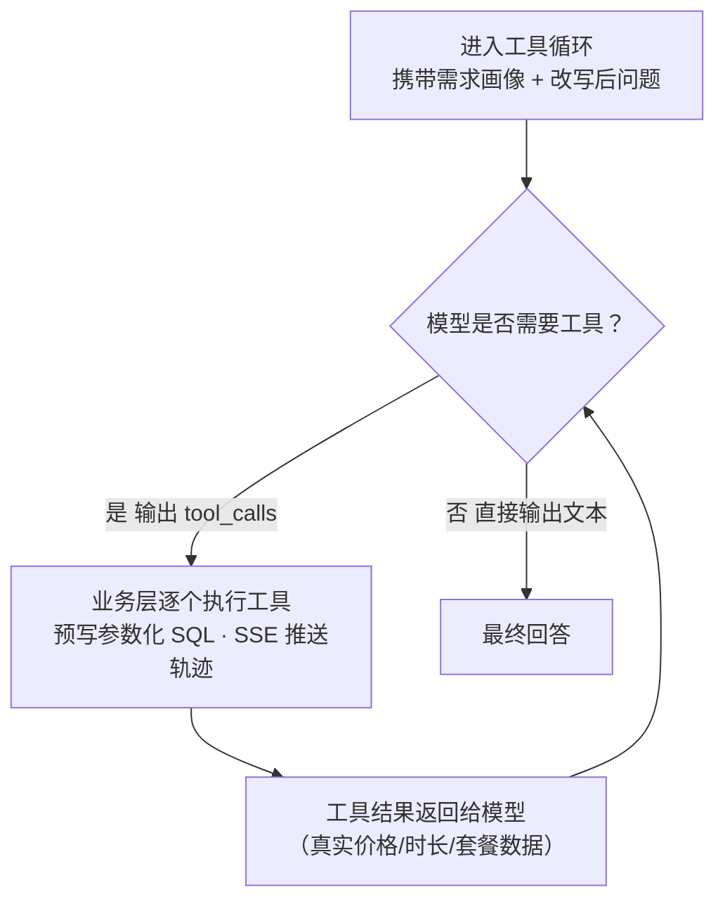

# 多轮智能问答 Demo（课程学习系统）

> 版本：v1.0（2026-08-02）
>
> 课程售课咨询场景的多轮 AI 智能问答 Demo：用户与 AI 多轮对话，系统通过查询改写、意图分类、约束累积和工具调用，逐步收窄候选课程并给出精准推荐，全程实时可视化。
>
> 配套文档：[方案设计](方案设计_多轮智能问答课程推荐系统.md) · [验收文档](验收文档_多轮智能问答Demo.md) · [调研报告](调研报告_多轮智能问答开源项目.md)

---

## 一、项目简介

这是一个课程学习系统的 **AI 售课咨询助手**：左侧课程货架展示 10 门课程，可点选或拖拽单个/多个进输入区；中间是多轮对话区；右侧实时直播 AI 的推理过程（工具调用轨迹）。后端基于 Spring AI 构建五步管线，使用 DeepSeek 在线大模型理解对话、SiliconFlow 免费向量模型做内容检索、SQLite 存业务数据。

多轮问答的核心命题：**如何通过多轮提问提高答案准确性**——不在第一轮就匹配所有可能，而是每轮对话把用户约束累积起来，候选课程随约束逐轮收窄，最后给出精准推荐。

## 二、功能特性

- **多轮精准推荐**：查询改写做指代消解，约束逐轮累积，候选池随对话动态收窄
- **工具调用可视化**：AI 内部调用工具的全过程（tool_start / tool_end）通过 SSE 实时直播到右侧推理面板
- **课程货架交互**：10 门课程卡片，可点选或拖拽单个/多个进输入区作为上下文
- **六类意图路由**：课程推荐 / 价格咨询 / 内容咨询 / 套餐咨询 / 学习规划 / 闲聊
- **防幻觉**：价格、时长、套餐等事实全部来自工具返回的真实数据，检索不到明确拒绝
- **业务闭环**：收口推荐（Top-N 加权评分）→ 生成订单号（demo 模拟）

---

## 三、系统架构



| 模块 | 职责 |
|---|---|
| 前端 | 课程货架交互、多轮对话、推理过程可视化、SSE 事件解析 |
| 后端 | 五步管线编排、工具执行、会话画像存储 |
| 工具层 | 7 个预写参数化 SQL 工具，AI 只填结构化参数，不直接碰数据库 |
| 在线服务 | DeepSeek 负责对话/改写/意图；SiliconFlow 负责内容向量化 |

---

## 四、核心流程

### 4.1 五步管线总览

用户每一轮消息进入后，依次走五个步骤：



### 4.2 查询改写（指代消解）

**输入**：历史对话 + 当前问题；**输出**：自包含的完整问题。
把"那大概要多少钱？"这类依赖上下文的问法，改写成不依赖上下文也能独立理解的问题，供后续步骤使用。



> 实测示例：用户第 3 轮问"那大概要多少钱？" → 改写为"推荐的这两门英语课程大概需要多少钱？" → 后续正确命中两门课的价格。

### 4.3 意图分类（场景路由）

**输入**：改写后的完整问题 + 当前需求画像；**输出**：六类意图之一，决定走哪条业务链。



| 意图 | 触发场景 |
|---|---|
| course_recommend | 找课程、求推荐 |
| price_query | 问价格、问多少钱 |
| content_query | 问课程里教什么内容 |
| package_query | 问套餐、问怎么买划算 |
| plan_query | 学习规划、时间够不够 |
| chitchat | 寒暄、无关闲聊 |

### 4.4 状态更新（约束累积）

**输入**：本轮用户消息 + 已有需求画像；**输出**：合并后的新画像，持久化到 SQLite。
每一轮从用户话里抽取约束（目标科目、水平、预算、时间……），累积进画像——这就是"多轮提问提高准确性"的关键：约束越多，候选越窄。



画像字段：目标科目 / 目标课程 / 水平 / 年级 / 时间限制（天）/ 预算 / 学习目标 / 已推荐。

### 4.5 工具循环（内层多轮）

系统向模型暴露 7 个工具。模型决定"需要查什么"并输出结构化参数（tool_calls），由业务层执行预写 SQL 返回真实数据，再交回模型；如此循环，直到模型认为信息足够、直接输出文本。每一步执行都通过 SSE 推送 `tool_start` / `tool_end`，前端实时渲染"直播"。



| 工具 | 作用 |
|---|---|
| search_courses | 按约束过滤课程候选池 |
| query_price | 查单课价格 + 可搭配套餐 |
| match_package | 匹配套餐 + 计算省钱金额 |
| search_content | 向量检索章节/单元/段落内容 |
| check_duration | 时长可行性检查 + 冲突替代建议 |
| finalize_recommend | 加权评分输出 Top-N 最终方案 |
| create_order | 生成订单号（demo 模拟） |

**关键设计**：AI 只填结构化参数（JSON），SQL 由人工预写的参数化模板执行——AI 不直接碰数据库。

### 4.6 生成回答

工具循环产出的最终文本即回答。回答中的价格、时长、套餐等事实全部来自工具返回的真实数据，从根本上避免大模型编造数字。

---

## 五、技术栈

| 环节 | 技术 |
|---|---|
| 后端 | Java 17 + Spring Boot 3.5.3 + Spring AI 1.1.6 |
| 生成模型 | DeepSeek-V4-Flash（OpenAI 兼容 API） |
| Embedding | SiliconFlow BAAI/bge-m3（免费） |
| 向量库 | SimpleVectorStore（内存，启动自动重建索引） |
| 关系库 | SQLite（backend/data/course.db） |
| 会话存储 | SQLite session_state 表 |
| 前端 | React 18 + Vite 5 + Ant Design X 1.6.1 |
| 端口 | 后端 8081 / 前端 5173 |

## 六、数据模型（SQLite）

| 表 | 内容 | 数据量 |
|---|---|---|
| subject | 科目 | 1（英语） |
| course | 课程（名称/教材/年级/是否课外/时长/简介） | 10 |
| chapter / unit / paragraph | 章节 → 单元 → 段落（知识点） | 18 段落 |
| pricing | 定价（单卖/套餐/包月/包年） | 10 单卖 |
| package / package_course | 套餐 + 套餐-课程映射 | 5 |
| session_state | 会话画像 JSON + 历史 | 运行时 |

---

## 七、快速开始

### 前置要求

- **JDK 17+**（后端运行；构建可用 Docker maven 镜像或本机 Maven）
- **Node.js 18+**（前端 Vite）
- **两个 API Key**：DeepSeek（对话）、SiliconFlow（embedding，bge-m3 免费）

### 配置与启动

```bash
# 1. 复制 .env.example 为 .env 并填入 Key
cp .env.example .env
# 2. 一键启动（后端 8081 + 前端 5173）
./start.sh
# 3. 停止
./start.sh stop
```

配置（`.env`）：

```env
DEEPSEEK_API_KEY=sk-...            # 必填
DEEPSEEK_MODEL=deepseek-v4-flash
EMBEDDING_BASE_URL=https://api.siliconflow.cn   # 不带 /v1（Spring AI 自动拼接）
EMBEDDING_API_KEY=sk-...           # 必填（bge-m3 免费）
```

浏览器打开 **http://localhost:5173** 体验，验收步骤对照 `验收文档_多轮智能问答Demo.md`。

---

## 八、目录结构

```
agent_demo/
├── start.sh                  # 一键启动/停止
├── .env                      # API Key 配置（勿提交）
├── docker-compose.yml        # 可选的后端容器化方式（默认不用 Docker）
├── README.md
├── 方案设计_多轮智能问答课程推荐系统.md
├── 验收文档_多轮智能问答Demo.md
├── 调研报告_多轮智能问答开源项目.md
├── backend/
│   ├── pom.xml               # Spring Boot 3.5.3 + Spring AI 1.1.6
│   ├── Dockerfile            # 可选容器化
│   ├── data/course.db        # SQLite（运行时生成）
│   └── src/main/java/com/demo/courserag/
│       ├── CourseRagApplication.java
│       ├── controller/ChatController.java      # /api/chat(SSE) /api/courses /api/packages
│       ├── service/AgentService.java           # 五步管线 + 工具循环
│       ├── service/ToolExecutor.java           # 7 工具 + FunctionToolCallback
│       ├── service/RetrievalService.java       # 向量检索 + 关键词兜底
│       ├── service/EmbeddingIndexer.java       # 启动向量化
│       ├── service/DatabaseInitializer.java    # 建表 + 种子数据
│       ├── repository/CourseRepository.java    # 业务查询（参数化 SQL）
│       ├── repository/SessionRepository.java   # 会话画像/历史
│       ├── config/VectorStoreConfig.java       # SimpleVectorStore Bean
│       └── model/                              # record 模型
└── frontend/
    ├── package.json          # React 18 + antd + @ant-design/x 1.6.1
    ├── vite.config.js        # 5173 → 代理 /api → 8081
    └── src/App.jsx           # 三栏布局（货架/对话/推理面板）+ SSE 解析
```

---

## 九、后续可改进

| 项 | 现状 | 改进方向 |
|---|---|---|
| 向量库 | 内存 SimpleVectorStore | 数据量大时换 ChromaDB/Milvus/pgvector |
| 流式输出 | 整段推送 | 改用 token 级 SSE 流式 |
| 长期记忆 | 会话内记忆 | 画像跨会话沉淀 |
| 评估 | 人工验收 | 加 Hit Rate/MRR/Groundedness 自动化评估 |
| 订单 | 模拟订单号 | 接真实库存/支付 |
| 安全 | 无鉴权 | 生产需加用户体系与限流 |

---

## 十、许可证

本项目为学习演示项目，未指定开源许可证（All Rights Reserved），代码仅供学习参考，请勿用于生产环境。
